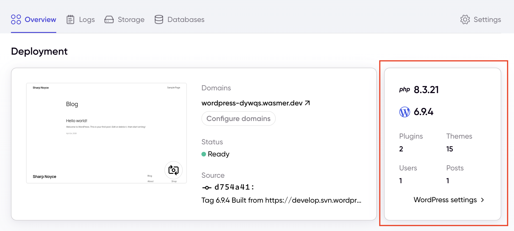

# Wasmer Integration

WP Wasmer is designed to expose WordPress deployment data and Wasmer-specific flows to the Wasmer platform.

## Environment Variables

The plugin reads the following environment variables:

- `WASMER_WEBSITE_URL`
  Optional explicit base URL for Wasmer. If omitted, the plugin derives the site URL from `WASMER_GRAPHQL_URL`.
- `WASMER_GRAPHQL_URL`
  Required for magic login. Used as the GraphQL endpoint for token validation.
- `WASMER_APP_ID`
  Required for magic login and for Wasmer dashboard links tied to a specific app.
- `WASMER_PERISHABLE_TIMESTAMP`
  Optional expiration timestamp used for the app claim UX in WordPress admin.

## How Wasmer Uses The Plugin

- Wasmer links back into the WordPress instance through the plugin's public REST endpoints.
- Wasmer uses the live configuration payload to understand the current WordPress runtime and content shape.
- Wasmer uses magic login to create a secure path from the Wasmer UI into WordPress admin.
- Wasmer uses the app ID and base URL helpers to build links to Wasmer-hosted dashboard and settings pages.

## How Wasmer Uses Liveconfig

Wasmer calls `GET /?rest_route=/wasmer/v1/liveconfig` to retrieve deployment metadata from the WordPress site.

That response powers the WordPress summary card shown on the Wasmer Dashboard Overview page. The same surfaced WordPress metadata also supports the Wasmer flow that sends a user into the WordPress settings page from the dashboard.

The visible values in the example below are typical `liveconfig`-driven fields exposed by the plugin:

- PHP version
- WordPress version
- plugin count
- theme count
- user count
- post count

_Wasmer uses the WordPress liveconfig endpoint to populate the deployment summary card and link into WordPress settings._

## Magic Login Flow

The `magiclogin` endpoint is the Wasmer-controlled entrypoint into WordPress admin:

- Wasmer sends a bearer token to the WordPress site through the `magiclogin` query parameter.
- The plugin validates that token against `WASMER_GRAPHQL_URL`.
- On success, the plugin authenticates a WordPress administrator and redirects to `wp-admin/?platform=wasmer`.

This allows Wasmer to provide a direct "open in WordPress" workflow without requiring the user to manually sign in through the standard WordPress login page first.
