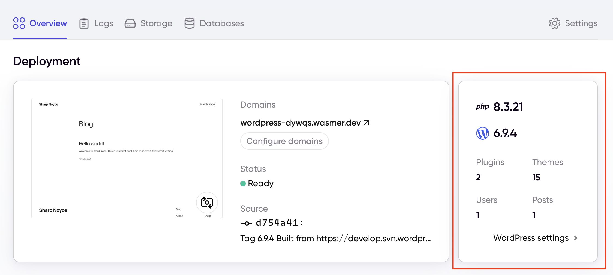

# Wasmer Integration

WP Wasmer is designed to expose WordPress deployment data and Wasmer-specific flows to the Wasmer platform.

## Environment Variables

The plugin reads the following environment variables:

- `WASMER_WEBSITE_URL`
  Optional explicit base URL for Wasmer. If omitted, the plugin derives the site URL from `WASMER_GRAPHQL_URL`.
- `WASMER_GRAPHQL_URL`
  Required for magic login and CDN cache purging. Used as the GraphQL endpoint for token validation and for the `purgeAppCdnCache` mutation.
- `WASMER_APP_ID`
  Required for magic login and for Wasmer dashboard links tied to a specific app.
- `WASMER_PERISHABLE_TIMESTAMP`
  Optional expiration timestamp used for the app claim UX in WordPress admin.
- `WASMER_API_TOKEN`
  Bearer token for authenticated calls to the Wasmer API, including the `purgeAppCdnCache` mutation. CDN cache purging is only active when this token is set.

## How Wasmer Uses The Plugin

- Wasmer links back into the WordPress instance through the plugin's public REST endpoints.
- Wasmer uses the live configuration payload to understand the current WordPress runtime and content shape.
- Wasmer uses magic login to create a secure path from the Wasmer UI into WordPress admin.
- Wasmer uses the app ID and base URL helpers to build links to Wasmer-hosted dashboard and settings pages.

## How Wasmer Uses Liveconfig

Wasmer calls `GET /?rest_route=/wasmer/v1/liveconfig` to retrieve deployment metadata from the WordPress site.

That response powers the WordPress summary card shown on the Wasmer Dashboard Overview page. The same surfaced WordPress metadata also supports the Wasmer flow that sends a user into the WordPress settings page from the dashboard.

The visible values in the example below are typical `liveconfig`-driven fields exposed by the plugin:

- PHP version
- WordPress version
- plugin count, including regular plugins, must-use plugins, and drop-ins
- theme count
- user count
- post count

Plugin and theme entries use WP-CLI-style identifiers in `name` and preserve the human-readable label in `title`. Their `status` and `auto_update` fields mirror the values returned by `wp plugin list --json` and `wp theme list --json`.



_Wasmer uses the WordPress liveconfig endpoint to populate the deployment summary card and link into WordPress settings._

## CDN Cache Purging

When `WASMER_API_TOKEN` is set, the plugin automatically purges the app's CDN cache after content changes. The Wasmer API only supports purging the whole app cache, via the `purgeAppCdnCache` GraphQL mutation against `WASMER_GRAPHQL_URL`:

```graphql
mutation {
  purgeAppCdnCache(app: "<app id>") {
    success
  }
}
```

### Automatic purge triggers

- A post is published or unpublished, a published post is edited, or a post/attachment is deleted. Autosaves, revisions, and non-viewable post types are ignored.
- A comment switches into or out of the approved state, or a new comment is posted and immediately approved.
- Site-wide changes: theme switch, customizer save, menu update, plugin (de)activation, core/plugin/theme updates, permalink structure change.

All triggers within a single request are coalesced into one purge call that runs on `shutdown`.

### Manual purge

- Admin bar: **Wasmer → Purge CDN Cache** (requires `manage_options`).
- WP-CLI: `wp wasmer purge-cdn-cache`.

### Hooks for developers

- `do_action('wasmer_cdn_cache_purge')` — request a purge from other plugins or themes.
- `apply_filters('wasmer_cdn_cache_purge_enabled', true)` — return `false` to disable automatic purging.
- `apply_filters('wasmer_cdn_purge_everything_actions', $actions)` — modify the list of simple actions that trigger a purge.
- `do_action('wasmer_cdn_cache_purged')` — fired after a successful purge.

## Magic Login Flow

The `magiclogin` endpoint is the Wasmer-controlled entrypoint into WordPress admin:

- Wasmer sends a bearer token to the WordPress site through the `magiclogin` query parameter.
- The plugin validates that token against `WASMER_GRAPHQL_URL`.
- On success, the plugin authenticates a WordPress administrator and redirects to `wp-admin/?platform=wasmer`.

This allows Wasmer to provide a direct "open in WordPress" workflow without requiring the user to manually sign in through the standard WordPress login page first.
